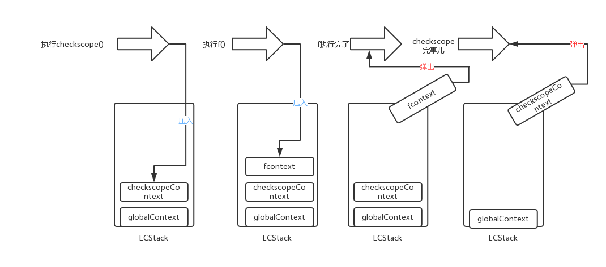
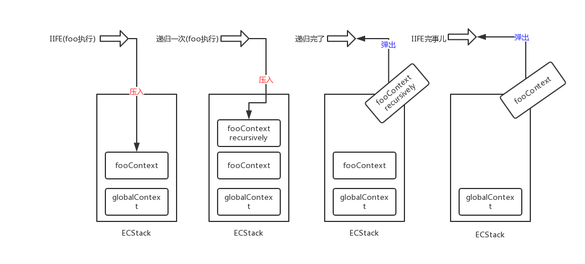

# 深入理解JavaScript系列（2）-- 执行上下文
***


# 前言

当你熟悉了上一篇提到的<a href='memory.md'>内存空间</a>之后。我们再来接着梳理我们的JS轴线。JS好比是易筋经，学透彻了这门功夫，在茫茫快速迭代的前端海洋就有了本源核心，剩下的就是踩坑捡秘籍，打怪娶萧熏儿了。

内存空间是入门心法，教会我们怎么运用自身的丹田来存储气息，下一步就应该是学会怎么将气息顺着经脉发力了。

我们大致了解了我们写的代码是怎么样分配空间存储的，现在该探究是怎么运行的了。首先运行也得准备准备吧!


# 执行上下文 & 可执行代码

>Execution context (abbreviated form — EC) is the abstract concept used by ECMA-262 specification for typification and differentiation of an executable code.


执行上下文(简称-EC)是一个抽象概念，ECMA-262标准用这个概念同可执行代码(executable code)概念进行区分。

当控制器转到一段可执行代码的时候就会进入到一个执行上下文。执行上下文是一个堆栈结构(先进后出),栈底部永远是全局上下文，栈顶是当前活动的上下文。其余都是在等待的状态，这也印证了JS中函数执行的原子性。

可执行代码与执行上下文是相对的，某些时刻二者等价。

所以，我们大声的用家乡话说一次就是：函数在调用的时候就为其创建一个执行上下文，压入上下文堆栈中。执行完了弹出去。或者是遇到了提前终止可执行代码进行的，比如return。

全局上下文在浏览器窗口关闭后出栈。

我们来看看可执行代码，一共有 3 种 ECMA 脚本可执行代码:

1. 全局代码
2. 函数代码
3. eval代码

我们使用数组来模拟一个上下文堆栈

```
ECStack = []
```

* 全局代码,例如:外部引入的js代码或者script标签内的本地代码。
 
    其上下文堆栈

    ```
    ECStack = [
        globalContext
    ]
    ```


* 函数代码

    进入函数的时候就会产生一个执行上下文为其后续的爆炸输出做筹备。这个执行上下文被压入了ECStack。

    倘若函数内部还有inner函数，进入这个inner函数的时候会创建它自己的执行上下文，也就是说函数代码不包括其inner的函数代码。

    我们举两个例子分析一下:

    1. ready... Go!
    
        ```
        // 1
        var scope = "global scope";
        function checkscope(){
            var scope = "local scope";
            function f(){
                return scope;
            }
            return f();
        }
        checkscope();

        // 2
        var scope = "global scope";
        function checkscope(){
            var scope = "local scope";
            function f(){
                return scope;
            }
            return f;
        }
        checkscope()();
        ```
        
        首先这个题是抄袭的<a href='https://github.com/mqyqingfeng'>冴羽</a>的。两个都是输出"local scope"，结果是一样的，但是其上下文堆栈中却发生着不同的故事。如果你觉得输出的不是这个结果，建议看看<a href='https://github.com/mqyqingfeng'>冴羽</a>的文章关于词法作用域和动态作用域的区别。

        我知道大家不喜欢看文字：

        对于 1 中发生的故事:
        
        

        对于 2 中的故事:

        

    2. ready... Go!
        
        ```
        (function foo(bar){
            if(bar){
                return;
            }
            foo(true);
        })()
        ```

        上面的函数明显自己揍了自己一次(递归)。
        
        即使是这样调用自己的时候也会创建一个执行上下文。便于理解，可以说是每次进入函数都会创建一个新的执行上下文。

        知道你们还是喜欢看 png。

        

        当相关段代码执行完以后，直到整个应用程序结束，ECStack都只包括全局上下文(global context)。

* eval代码

    eval 是万恶的!劫持作用域等罪名集于一身，不过我们还是简单了解一下。

    **eval有一个概念叫做调用上下文(calling stack)，这是一个当eval函数被调用产生的上下文。**

    ```
    eval('var x = 10');

    (function foo(){
        eval('var y = 20');
    })()

    alert(x); // 10
    alert(y); // "y" is not defined
    ```

    还是用png来说明问题(用evalContext-x，evalContext-y分别表示其上下文)
    
    

    我们以前一般是这样理解的，eval劫持了foo内的作用域，全局环境中没有y声明了。

    现在开始结合调用上下文理解吧!

# 参考

<a href='https://bclary.com/log/2004/11/07/#a-10'>ECMA-262 # 10</a></br>
<a href='https://github.com/mqyqingfeng/Blog/issues/4'>冴羽 blog</a></br>

# 下一章

<a href='vo.md'>深入理解JavaScript系列（3）-- 变量对象</a>

# 结语

撸主实力有限，高手历来在民间，希望广提意见，补肾感激。欢迎star，对我也是一种鼓励。