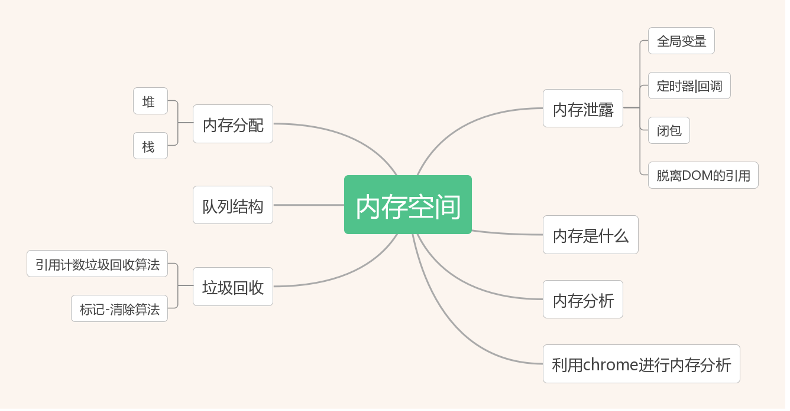
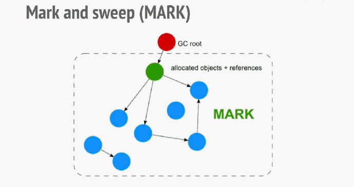
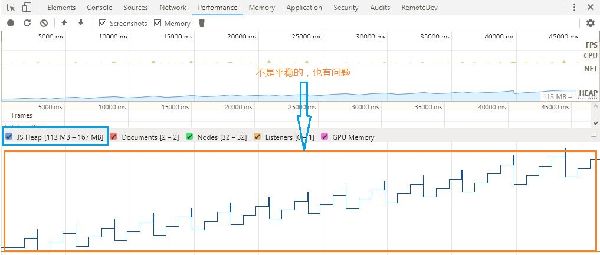

# 深入理解JavaScript系列（1）-- 内存空间
***

# 前言
***
一直以来对JS的理解和认识总是零散杂乱。近期希望整理出一条主线来，把JS的各路好汉串联起来。

我相信很多人和我一样，对JS这门动态弱类型语言的学习常常是倒过来的，就是咱先用着，然后再时不时的看些知识点补充。

为了面试或者装逼，常常从言语不可描述的角度去看待这门语言，本身无可厚非。

怎奈我就是一俗人，希望用我粗暴浅显的理解，去重新认识JavaScript，拥抱JavaScript(此处换成小泽老师、苍井老师......)。

进入正题，可能以前我们并不关心内存空间，从而导致对内存泄露、深浅拷贝等知识点的理解有点模糊。我的JS主轴线就是从内存分配开始。

ps: 图片看不到的，请用chrome、FF、opera。

# 数据结构与算法
***
原谅我标题党一把，什么数据结构与算法都来了。哈哈哈...

其实我是想说所有的语言都是为了博数据一笑而烽火戏程序猿，数据的存取当然不容忽视，我想从数据住的大房子来开始我的重新认识JS之旅。

这样的大房子(内存空间)，在所有的编程语言中都拥有相似的生命周期:

1. 我爱你，我给你一栋大房子(内存分配)。
2. 你懂的...(内存使用: 读、写)
3. 禁不起时间的考验，我要收回大房子，不欢而散。(内存释放--"垃圾回收")

JS作为一门高级中的VIP的语言。在创建变量的时候会为其分配内存空间，分配内存的举动是在值的初始化、函数调用等阶段完成。在程序中，使用值的过程其实就是对值的内存空间进行写入和读取。

最后，不再使用的内存空间会被自动的进行"垃圾回收"。但是确定一个分配的内存空间是不是不再使用确实让人头疼，而且自动一词让很多人不再关注于"垃圾回收"，这恰恰是一个美丽的错误！

我的JS梳理路线第一波：



所以我们需要了解但是不限于以下知识点：

1. 内存是什么?
2. 堆('heap')
3. 栈('stack')
4. 队列('queue')
5. 基本类型与引用传递
6. 深浅拷贝
7. 垃圾回收
8. 内存泄露
9. chrome工具进行内存分析


# 内存是什么?

* * *

硬件上计算机存储器由大量的触发器组成，触发器包含了一些晶体管。每个触发器可以存储1bit(也叫做"位")。触发器有唯一标识用来寻址，因此我们得以读取或者覆盖它们。

触发器的组合形成更大的单位，比如8bit为1个字节(byte)，还有kb...

我们可以抽象理解计算机的整个内存是一个巨大的数组。

## 静态内存分配和动态内存分配

对于原始数据类型:

```
int a; // 4个字节
int b[4]; // 4 * 4个字节
double c; // 8 个字节
```

编译器会检查数据类型并且提前计算出所需的空间大小(4+4*4+8)。然后为这些原始数据变量分配空间，分配的空间我们称为"栈空间"。假如这些变量定义在一个函数中，当函数被调用的时候，它们的内存就加入到现有的内存中，函数调用终止，它们就会被移除。

编译器能够准确知道上面每一个原始数据变量的地址，并且在插入与操作系统交互的代码的同时在栈上为其它们申请对应字节数的空间。这个过程就是静态内存分配，也有称之为"自动分配"。

>如果操作b[4]，因为这个元素并不存在，因为数组长度为4。所以最终可能读取(重写)到c的位。从而导致一些bug。

又如果:
```
int n = someFuncReturnN(...)
```

编译器并不能提前的计算出变量所需的空间大小,而是在运行的时候才能确定的，这个时候不能在栈上为其分配空间了，所以这个内存是分配在堆('heap')空间上的。

堆内存涉及指针操作。不再赘述....说多了我就懵了。

## 静态内存分配和动态内存的区别：

1. 静态内存分配: 
    
    * 编译期知道所需内存空间大小。
    * 编译期执行
    * 申请到栈空间
    * LIFO(后进先出)
    
2. 动态内存分配:
    
    * 编译期不知道所需内存空间大小
    * 运行期执行
    * 申请到堆空间
    * 没有特定的顺序

总之说那么多，还不如一句话:

>stack是采用静态内存分配的内存空间，由系统自行释放。heap是采用动态内存分配的内存空间，无序，大小不定，不会自动释放，哪怕你退出程序，那一块内存还是在那儿。

# 堆('heap')
***
卧槽，前边讲多了，这里不知道说啥了。反正根据前边说的动态分配和静态分配我们可以知道:

在JavaScript中，引用类型数据(对象、数组、函数)，这么说不太准确，数组和函数也是对象，就这么地吧。

它们都是申请到堆空间的，然后有一个引用，可以理解为一个指针，它保存了这个对象在堆中的位置。这个引用是存到栈中的。

# 栈('stack')
***
也叫堆栈。基本数据类型String，Boolean之类的变量是申请到栈空间的。

# 队列('queue')
***
之前看过一个段子:

>栈和队列的区别? --吃多了拉就是队列，吃多了吐就是栈。

这特么也太有才了。不过说明了栈和队列的特点: 前者先入后出、后者先入先出。

# 基本类型与引用传递
***
搞清楚内存空间，再遇到这种面试题就不会瑟瑟发抖了。

```
var a = 30;
var b = a;
b = 30;
// a是多少?

var obj = {a: 20, b:30}
var newObj = obj;
newObj.a = 25;
// obj.a是多少?
```

没啥说的，前者a,b都在栈空间申请了内存，var b=a的时候分配了新的值。两者互不相干。

后边的是引用传递，两者指向堆内存空间的某个位置的同一个对象。所以对对象的操作是互相影响的。

# 深浅拷贝
***
浅拷贝：可以理解为只拷贝了1层，如果有数组之类的对象的话，实际是拷贝了其引用。所以操作该对象是互相影响的。内存上是两个引用指向了堆空间中的同一对象

```
var o = {
    name: 'jack ma',
    friends: ['李彦宏', '马化腾']
}

var c = Object.assign({}, o);

c.friends.push('雷军');
o.friends; // ["李彦宏", "马化腾", "雷军"]
```

深拷贝: 就是递归的拷贝，把属性值也拷贝了。互不影响了。内存上是两个引用分别指向了堆空间中的不同对象，但是初始值是一样的。

```
var o = {
    name: 'jack ma',
    friends: ['李彦宏', '马化腾']
}

var c = JSON.parse(JSON.stringify(o))

c.friends.push('雷军');
o.friends; // ["李彦宏", "马化腾"]
```

# 垃圾回收
***
垃圾回收是JS自动完成的，但是不代表我们就不去关注它。实际上确定一个内存不再被使用，然后将其释放是很难的。通常有以下几种算法实现，但是也有很大的局限性。

1. 引用计数垃圾收集算法
    
    这个算法是最简单的，假如一个对象没有指针指向它，那它就被认为是可回收的。

    下面是MDN上面的例子：

    ```
    var o = { 
      a: {
        b:2
      }
    }; 
    // 两个对象被创建，一个作为另一个的属性被引用，另一个被分配给变量o
    // 很显然，没有一个可以被垃圾收集


    var o2 = o; // o2变量是第二个对“这个对象”的引用

    o = 1;      // 现在，“这个对象”的原始引用o被o2替换了

    var oa = o2.a; // 引用“这个对象”的a属性
    // 现在，“这个对象”有两个引用了，一个是o2，一个是oa

    o2 = "yo"; // 最初的对象现在已经是零引用了
               // 他可以被垃圾回收了
               // 然而它的属性a的对象还在被oa引用，所以还不能回收

    oa = null; // a属性的那个对象现在也是零引用了
               // 它可以被垃圾回收了
    ```

    这种算法的局限性体现在循环引用
    ```
    function f() {
      var o1 = {};
      var o2 = {};
      o1.p = o2; // o1 references o2
      o2.p = o1; // o2 references o1. This creates a cycle.
    }

    f();
    ```
    
    这样垃圾收集器会认为对象至少会被引用一次，而不会回收这块内存。导致内存泄露。

2.  标记-清除算法
    
    这个算法是现在浏览器基本都有的，其核心思想就是不能被引用的对象可被回收。

    原理大致是:

    1. 有一个GC root列表，保存了引用的全局变量，比如 "window".
    2. root被认为是活动的，不被回收，然后递归检查其子节点，可以被访问的都标记为活动的。
    3. 所有的不被标记的，都是可回收的。
    
    

    这样的话，上面的循环引用，在函数结束后，o1,o2不再被全局变量所能访问的对象引用。就会被认为是垃圾

# 内存泄露
***
首先GC是无法预测的，其实回收更多的是取决于我们自己怎么去写程序。或多或少年少的我们写的代码都导致了一些内存无法被释放，造成了内存的泄露。

# 常见的内存泄露
***
以下都是copy的经典例子。

1. 全局变量
    
    根据上边的标记-清除算法，root列表中的全局变量是不会被释放的。所以我们的代码中显式的全局或者隐式的全局变量是不会被垃圾收集器回收的。

    隐式的情况全局变量有(还有很多):
    
    1. 忘记写声明了。
    
        ```
        function foo(){
            boss = 'jack ma'
        }
        foo();
        window.boss; // "jack ma"
        ```
        
        引擎对boss进行LHS查询，在当前作用域没有找到声明，就去外层也就是全局之中找，也特么没找到，这个时候它就会发善心，给你创建一个声明。所以输出window.boss是上面的结果。

        避免这种情况的办法就是'use strict'。

    2. this的默认绑定规则
    
        ```
        function foo(){
            this.boss = 'jack ma'
        }
        foo();
        window.boss; // "jack ma"
        ```
        
        独立的函数声明采用的是默认绑定规则，也就说this是绑定到全局的。
        采用'use strict'可以是默认绑定到undefined。

2. 被遗忘的时光 | 回忆

    定时器我们常常使用。

    ```
    var serverData = loadData();
    setInterval(function() {
        var renderer = document.getElementById('renderer');
        if(renderer) {
            renderer.innerHTML = JSON.stringify(serverData);
        }
    }, 5000);
    ```
    
    IE6时代，假如serverData有大量的数据，它是没办法被收集的。但是现代浏览器在这个问题已经做了优化，无需担心。

3. 闭包

    ```
    var theThing = null;
    var replaceThing = function () {
      var originalThing = theThing;
      var unused = function () {
        if (originalThing) // a reference to 'originalThing'
          console.log("hi");
      };
      theThing = {
        longStr: new Array(1000000).join('*'),
        someMethod: function () {
          console.log("message");
        }
      };
    };
    setInterval(replaceThing, 1000);
    ```
    
    一旦具有相同父作用域的多个闭包的作用域被创建，则这个作用域就可以被共享。
    也就是说为someMethod创建的作用域是被unused共享的。
    
    theThing作为root持有对someMethod的引用，unused引用的originalThing，也迫使其不会被回收。

    这个问题是Meteor小组发现的，有兴趣可以百度。

4. 脱离DOM的引用

    ```
    var elements = {
        button: document.getElementById('button'),
        image: document.getElementById('image')
    };
    function doStuff() {
        elements.image.src = 'http://example.com/image_name.png';
    }
    function removeImage() {
        // 删除了DOM树中对 image 的引用
        document.body.removeChild(document.getElementById('image'));
        // 但是GC并不会回收。因为elements还引用了呀！
    }
    ```

# chrome工具进行内存分析
***
利用浏览器进行内存分析具体步骤请执行点击下面的参考最后两个。

我们以上边的闭包为例:





还有各种size之类的我就不说了。反正chrome强大的一比！


# 参考

<a href='https://developer.mozilla.org/zh-CN/docs/Web/JavaScript'>MDN</a></br>
<a href='https://medium.com/m/global-identity?redirectUrl=https://blog.sessionstack.com/how-javascript-works-memory-management-how-to-handle-4-common-memory-leaks-3f28b94cfbec'>How JavaScript works: memory management + how to handle 4 common memory leaks</a></br>
<a href='https://en.wikipedia.org/wiki/Tracing_garbage_collection'>Tracing garbage collection</a></br>
<a href='http://www.ruanyifeng.com/blog/2017/04/memory-leak.html'>ruanyf blog</a></br>
<a href='https://www.smashingmagazine.com/2012/06/javascript-profiling-chrome-developer-tools/'>chrome工具进行内存分析</a>

# 下一章

<a href='executionContext.md'>深入理解JavaScript系列（2）-- 执行上下文</a>

# 结语

撸主实力有限，高手历来在民间，希望广提意见，补肾感激。欢迎star，对我也是一种鼓励。
