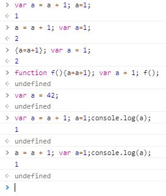

# 表达式

javascript就是一门语言，也有自己的语法。比如:

```
var a = 42; // 这就是一个声明语句
```

上面代码中的 a = 42就是一个表达式。


## 语句

我们常常忽略一个细节，你在浏览器的控制台打印var a = 42;执行，观察其输出:


注意上面红色框部分(图片加载不出来的话，No IE!!)。

自己也可以试试，很有趣



可能你很早就留意到了这个，其实就是语句的结果值。

我们不能直接获取这个结果值:

```
var a, b; a = if(true){b=42}; // Uncaught SyntaxError: Unexpected token if
```

除了这样:

```
var a,b; a = eval('if(true){b=42}'); // 42
```

万恶的eval()。执行了这个语句，并返回了结果。在实际开发中千万不要这样!!!

>ES7有一个do语法的提案，用于取代eval。


控制台返回的语句结果是表达式(不含var的)的返回值。同时表达式可能会产生副作用。

```
// 针对上面第二个图结果证明一下。
var a = a + 1; var b = eval('a=1');b; // 1
var b = eval('a=a+1');var a = 1;b; // 2
var b = eval('function f(){ a=a+1}');var a = 1; f();b; // undefined
```

比如 = 赋值操作就有副作用啊

```
var a; a = 42; // 42

var a; var b = eval('a=42');b; // 42
```

可见 = 号 的副作用就是赋值。我怎么说了个废话。

我们其实常常用副作用简化代码，只是不知道这是副作用带来的好处。

```
var a, b, c; a = b = c = 42;

// or
function f(str){
    if(str && (matches = str.match(/[abc]/g))){
        return matches
    }
}

f('abcdefg') //  ["a", "b", "c"]
```

或者我们让 a++ 不是先返回 a。而是直接返回 a增加1后的值

```
var a = 42;
// 这里的 a 也是一个表达式，会产生一个副作用，就是给a赋值一个a++执行后的a值
var b = (a++, a);
b;// 43
```

## 标签语句

标签语句最直白的例子就是用于跳出循环:

```
foo: for(var i = 0; i<4; i++){ // foo就是一个标签
    for(var j = 0; j<4; j++){
        if(j==i){
            continue foo; // 跳转到foo的下一个循环
        }

        if((i*j) % 2 == 1){
           continue // 跳出到当前循环的下一轮
        }

        console.log(i,j)
    }
}

<!-- 
1 0
2 0
2 1
3 0
3 2 -->
```

还可以这样用。

```
function f(){
    bar: { // bar标签
        console.log('hello');
        break bar; // 跳出当前代码块
        console.log('tom');
    }
    console.log('world')
}

f();

// hello
// world
```


## 异常

这里并不会去说明异常的有关概念，只是说明一个问题。

```
function f(){
    try{
        return 42
    }finally{
        console.log('world')
    }
}
console.log(f());

// world
// 42 --> 说明finally执行完了，foo()才会执行完毕
// 如果finally里面抛出异常，整个函数终止，返回值被丢弃
// finally中如果有返回值，会覆盖前边的返回值
```

try...finally...和yield一起的话，就更有意思了。yield在生成器重新开始时才结束。意味着try{...yield...}并未结束，因此finally不会在yield之后立即执行。


